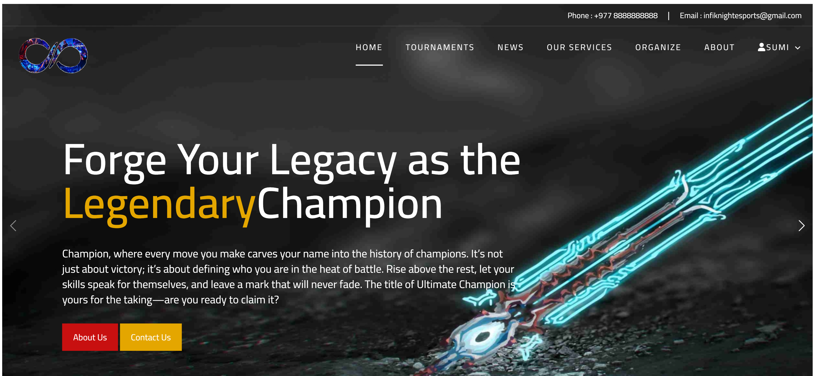

# Sumindra Chaudhary - Portfolio Website

A modern, responsive portfolio website showcasing my skills, projects, and professional journey as a web developer and digital visual artist.

## Features

- **Interactive UI**: Custom cursor effects, animations, and responsive design
- **Dark/Light Mode**: Toggle between color schemes
- **Audio Integration**: Background music option
- **Smooth Animations**: Using AOS (Animate On Scroll) library
- **Responsive Design**: Works on all device sizes
- **Accessibility**: ARIA labels and semantic HTML

## Technologies Used

- HTML5, CSS3, JavaScript
- [AOS Library](https://michalsnik.github.io/aos/) for scroll animations
- Google Fonts for typography
- Netlify for deployment

## Sections

1. **Home**: Introduction and quick overview
2. **About Me**: Professional background and bio
3. **Skills**: Tech stack and tools I work with
4. **Projects**: Featured work with live demos
5. **Contact**: Social media links and email

## Projects Showcased

1. **InfiKnight** - Esports tournament platform
   - GitHub: [github.com/cdrysumindra110/infiknight](https://github.com/cdrysumindra110/infiknight)
   - Live: [infiknight.great-site.net](https://infiknight.great-site.net/)

2. **Photography Blog** - Photography portfolio site
   - GitHub: [github.com/cdrysumindra110/photography](https://github.com/cdrysumindra110/photography)
   - Live: [sumindraphotography.netlify.app](https://sumindraphotography.netlify.app)

## Installation

No installation required - simply visit the live site at [https://sumindra.com.np/](https://https://sumindra.com.np//).

For local development:
1. Clone the repository
2. Open `index.html` in your browser

## Contact

- Email: [cdrysumindra110@gmail.com](mailto:cdrysumindra110@gmail.com)
- GitHub: [github.com/cdrysumindra110](https://github.com/cdrysumindra110)
- LinkedIn: [linkedin.com/in/sumindra-chaudhary](https://www.linkedin.com/in/sumindra-chaudhary-00769130b/)
- Instagram: [instagram.com/bloodehancxy](https://www.instagram.com/bloodehancxy/)

## License

This project is open source and available under the [MIT License](LICENSE).

---

© 2022 Sumindra Chaudhary | Designed and Built with ❤️